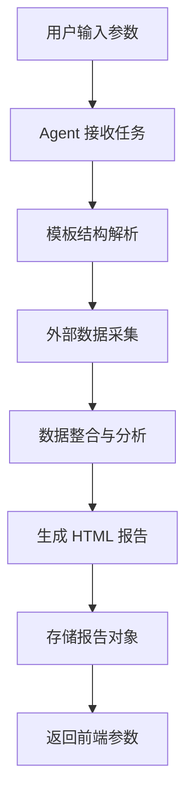

# 产品需求文档：Market Insight Agent

**版本**：v2.0  
**日期**：2026-02-02  
**项目代号**：Market Insight Agent

---

## 1. 项目概述 (Project Overview)

### 1.1 项目背景

本项目旨在开发一套智能化市场洞察报告生成系统，通过 AI Agent 自动化完成数据采集、分析与报告生成的全流程。系统将整合多个外部数据源（小红书、抖音、Tavily），并基于预设的 HTML 模板生成专业的市场分析报告。

### 1.2 核心目标

- **自动化报告生成**：根据用户输入参数，自动生成结构化的 HTML 报告
- **多源数据整合**：融合小红书、抖音、Tavily 等平台数据
- **模板驱动**：基于参考 HTML 模板拆解并填充报告内容
- **灵活扩展**：支持后续接入更多数据源（Facebook、Instagram、Twitter 等）

---

## 2. 产品功能模块

本系统包含两个核心功能模块：

### 2.1 模块一：品牌健康度诊断

#### 界面描述
用于分析品牌的市场健康状况，生成综合诊断报告。

#### 输入字段

| 字段名称 | 类型 | 必填 | 描述 | 示例 |
|---------|------|------|------|------|
| 品牌名称 | String | 是 | 目标分析品牌 | "AOS"、"海飞丝" |
| 推荐竞品 | String | 否 | 竞品品牌列表，多个用逗号分隔 | "BrandX, BrandY, BrandZ" |
| 地区 | String | 是 | 目标分析地区，用于地区针对性决策 | "中国大陆"、"美国"、"东南亚" |

> **说明**：地区字段将影响报告中的商业决策分析板块。不同地区的市场环境、消费习惯、竞争格局不同，生成的策略建议也会有所差异。

#### 报告输出结构
（基于参考 HTML 模板拆解）

- **品牌概述**：品牌基本信息与市场定位
- **消费者分析**：目标人群画像、消费行为
- **竞品对比**：与竞品的市场份额、产品策略对比
- **社媒声量**：小红书、抖音等平台的品牌提及与口碑
- **地区商业决策**：基于目标地区的市场特性，提供针对性的营销策略建议
- **SEO 诊断**：🚧 暂未启用（预留功能，后续版本开放）

---

### 2.2 模块二：TikTok 社媒洞察

#### 界面描述
分析 TikTok 爆款视频，洞察市场趋势与卖点策略。

#### 输入字段

| 字段名称 | 类型 | 必填 | 描述 | 示例 |
|---------|------|------|------|------|
| 品类名 | String | 是 | 分析的商品品类 | "美妆"、"家居" |
| 商品卖点 | String | 是 | 商品核心卖点关键词 | "长效控油"、"便携式设计" |

#### 报告输出结构
（基于参考 HTML 模板拆解）

- **品类热度趋势**：品类在 TikTok 的热度变化
- **爆款视频分析**：Top 视频案例及成功因素
- **卖点策略洞察**：各类卖点的市场表现与效果
- **达人生态**：相关品类的达人特征与合作建议
- **创意方向建议**：基于数据的内容创意策略

---

## 3. Agent 工作流程

### 3.1 核心工作流



### 3.2 Agent 三大核心任务

#### 任务 1：模板结构拆解

- **输入**：预设的参考 HTML 模板
- **处理**：
  - 解析 HTML 的 DOM 结构
  - 识别各报告模块（如消费者分析、竞品分析等）
  - 提取需要动态填充的内容区块
- **输出**：结构化的报告骨架（Report Schema）

#### 任务 2：数据采集与填充

- **输入**：
  - 用户提交的字段（品牌名称、品类名等）
  - 报告骨架
- **处理**：
  - 调用外部 API 获取数据
  - 将数据映射到对应的报告模块
  - 执行内容生成与格式化
- **数据源**：
  - **小红书 API**：获取品牌/品类相关笔记、达人数据
  - **抖音 API**：获取视频热度、达人带货数据
  - **Tavily API**：进行全网搜索，获取市场动态与新闻

#### 任务 3：报告生成与存储

- **输入**：填充完成的报告数据
- **处理**：
  - 渲染为完整的 HTML 文件
  - 保持原模板的 CSS 样式与布局
  - 存储为后台对象
- **输出**：
  - 生成的 HTML 报告（存储在后台）
  - 返回给前端的调用参数（报告 ID、访问 URL 等）

---

## 4. 数据源接入

### 4.1 已规划数据源

| 数据源 | 状态 | 用途 | 备注 |
|--------|------|------|------|
| 小红书 API | 待接入 | 品牌口碑、笔记分析、达人数据 | 第一优先级 |
| 抖音 API | 待接入 | 视频热度、带货数据、品类趋势 | 第一优先级 |
| Tavily API | 待接入 | 全网搜索、实时新闻、市场动态 | 第一优先级 |
| Facebook | 预留接口 | 海外社媒数据 | 暂不实现 |
| Instagram | 预留接口 | 海外社媒数据 | 暂不实现 |
| Twitter | 预留接口 | 海外社媒数据 | 暂不实现 |

### 4.2 数据获取策略

```
优先级顺序：
1. 平台专属 API（小红书、抖音）→ 获取精准平台数据
2. Tavily 全网搜索 → 补充通用市场信息
3. 缓存数据 → 针对高频查询做缓存优化
```

---

## 5. 技术实现方案

### 5.1 整体架构

```
┌─────────────────────────────────────────────────────────────────┐
│                          Frontend                               │
│   ┌─────────────────────┐    ┌─────────────────────┐           │
│   │   品牌健康度诊断     │    │   TikTok社媒洞察    │           │
│   │   - 品牌名称        │    │   - 品类名          │           │
│   │   - 推荐竞品        │    │   - 商品卖点        │           │
│   └──────────┬──────────┘    └──────────┬──────────┘           │
└──────────────┼──────────────────────────┼───────────────────────┘
               │                          │
               ▼                          ▼
┌─────────────────────────────────────────────────────────────────┐
│                        Backend API                              │
│   ┌─────────────────────────────────────────────────────────┐   │
│   │                   市场洞察 Agent                         │   │
│   │   ┌───────────┐  ┌───────────┐  ┌───────────┐          │   │
│   │   │ 模板解析  │→ │ 数据采集  │→ │ 报告生成  │          │   │
│   │   └───────────┘  └───────────┘  └───────────┘          │   │
│   └─────────────────────────────────────────────────────────┘   │
└──────────────┬──────────────────────────────────────────────────┘
               │
               ▼
┌─────────────────────────────────────────────────────────────────┐
│                     External Data Sources                        │
│   ┌──────────┐   ┌──────────┐   ┌──────────┐   ┌──────────┐   │
│   │ 小红书API │   │ 抖音API  │   │ Tavily   │   │ 预留接口 │   │
│   └──────────┘   └──────────┘   └──────────┘   └──────────┘   │
└─────────────────────────────────────────────────────────────────┘
```

### 5.2 API 接口设计

#### 5.2.1 品牌健康度诊断接口

```json
POST /api/v1/brand-health

Request Body:
{
    "brand_name": "AOS",                           // 必填：品牌名称
    "competitors": ["BrandX", "BrandY", "BrandZ"], // 可选：竞品列表
    "region": "中国大陆"                            // 必填：目标地区
}

Response:
{
    "success": true,
    "data": {
        "task_id": "task_abc123",      // 任务唯一标识
        "status": "processing"          // 状态：processing | completed | failed
    }
}
```

#### 5.2.2 TikTok 社媒洞察接口

```json
POST /api/v1/tiktok-insight

Request Body:
{
    "category": "美妆",                             // 必填：品类名
    "selling_points": ["长效控油", "便携式设计"]      // 必填：商品卖点
}

Response:
{
    "success": true,
    "data": {
        "task_id": "task_xyz789",      // 任务唯一标识
        "status": "processing"          // 状态：processing | completed | failed
    }
}
```

#### 5.2.3 任务状态查询接口

```json
GET /api/v1/tasks/{task_id}

Response (处理中):
{
    "success": true,
    "data": {
        "task_id": "task_abc123",
        "status": "processing",
        "progress": 60,                  // 进度百分比 (0-100)
        "message": "正在采集小红书数据..."
    }
}

Response (已完成):
{
    "success": true,
    "data": {
        "task_id": "task_abc123",
        "status": "completed",
        "report_type": "brand_health",   // brand_health | tiktok_insight
        "html_content": "<!DOCTYPE html>...",  // 完整 HTML 报告内容
        "created_at": "2026-02-02T12:00:00Z",
        "completed_at": "2026-02-02T12:02:15Z"
    }
}

Response (失败):
{
    "success": false,
    "data": {
        "task_id": "task_abc123",
        "status": "failed",
        "error": "外部API调用失败",
        "details": "Tavily API 超时"
    }
}
```

### 5.3 报告存储与交付方案

- **存储格式**：HTML 文件（完整的自包含 HTML，包含内联 CSS 和 SVG 图表）
- **存储位置**：后端内存/临时缓存（任务完成后保留一定时间）
- **交付方式**：通过 API 直接返回 HTML 字符串内容给前端
- **前端处理**：前端接收 HTML 内容后，自行决定渲染展示或存储到官网系统

> **设计理念**：后端专注于报告生成，前端负责存储和展示，职责分离更清晰。

---

### 5.4 技术栈选型

#### 5.4.1 后端框架

| 技术 | 选型 | 说明 |
|------|------|------|
| **编程语言** | Python 3.10+ | 丰富的 AI/数据处理库生态 |
| **Web 框架** | FastAPI | 高性能异步框架，自动生成 API 文档 |
| **Agent 框架** | LangGraph | 基于状态机的 Agent 编排框架，支持复杂工作流 |
| **任务队列** | Celery + Redis | 异步任务处理，支持进度追踪 |
| **数据库** | SQLite (开发) / PostgreSQL (生产) | 存储任务状态、历史元数据 |

#### 5.4.2 AI 模型

| 组件 | 配置 |
|------|------|
| **LLM 接口** | OpenAI 兼容格式的中转 API |
| **主要用途** | 模板理解、数据分析、洞察生成、文本填充 |
| **备用方案** | 支持切换不同 LLM 提供商（通过配置） |

#### 5.4.3 图表渲染

| 方案 | SVG 动态生成 |
|------|--------------|
| **实现方式** | Agent 根据数据计算坐标点，生成 SVG 代码 |
| **优点** | 完全静态，无需 JS 环境，易于存储和分发 |
| **支持图表** | 折线图、柱状图、雷达图、环图等 |

#### 5.4.4 部署环境

| 环境 | 配置 |
|------|------|
| **云服务商** | 华为云 |
| **计算资源** | ECS 云服务器 |
| **依赖服务** | Redis（任务队列）、PostgreSQL（数据存储） |

---

## 6. 模板管理

### 6.1 模板要求

- **格式**：标准化 HTML 文件
- **结构**：清晰的 DOM 层级，便于 Agent 解析
- **样式**：内联 CSS 或独立样式文件，保证渲染一致性

### 6.2 模板维护

- 模板作为内部知识库维护
- 支持动态更新（无需重新部署）
- 按功能模块分类存储：
  - `templates/brand_health.html` - 品牌健康度诊断模板
  - `templates/tiktok_insight.html` - TikTok 社媒洞察模板

---

## 7. 开发计划

### 7.1 阶段一：MVP 核心功能

**目标**：跑通「模板解析 → 数据采集 → 报告生成」的完整链路

- [ ] 搭建基础 Agent 框架
- [ ] 实现模板 DOM 解析能力
- [ ] 接入 Tavily API 进行全网搜索
- [ ] 实现基础报告生成与存储
- [ ] 完成前后端接口联调

### 7.2 阶段二：多源数据接入

**目标**：引入小红书、抖音数据，提升报告深度

- [ ] 接入小红书 API
- [ ] 接入抖音 API
- [ ] 实现混合检索逻辑
- [ ] 优化数据融合策略

### 7.3 阶段三：产品优化

**目标**：提升用户体验与系统稳定性

- [ ] 报告模板可视化编辑
- [ ] 历史报告管理
- [ ] 批量生成支持
- [ ] 性能优化与缓存策略

---

## 8. 注意事项

### 8.1 开发阶段注意事项

1. **外部 API 模拟**：开发初期，小红书和抖音 API 使用模拟数据，接口预留好，后续替换为真实 API
2. **模板完整性**：生成报告需尽量保留原 HTML 的 CSS 类名和布局结构，保证视觉一致性
3. **错误处理**：当外部 API 不可用时，需有降级策略（如使用 Tavily 补充，或返回部分报告）
4. **异步处理**：报告生成可能耗时 30s-2min，必须采用异步任务机制，避免 HTTP 请求超时

### 8.2 前后端协作约定

1. **接口契约**：
   - 所有输入字段均为 String 类型，由前端处理好格式
   - 后端不做字段验证之外的复杂处理（如地区映射等）
   
2. **异步交互流程**：
   ```
   前端提交请求 → 后端返回 task_id → 前端轮询 /api/v1/tasks/{task_id}
   → 获取 html_content → 前端存储/展示
   ```

3. **轮询建议**：
   - 初始间隔：2 秒
   - 逐步增加：2s → 3s → 5s（避免过度请求）
   - 超时时间：5 分钟（超时提示用户重试）

### 8.3 SEO 功能占位

- 当前版本 SEO 相关板块在报告中显示为 "🚧 此功能暂未启用，敬请期待"
- 后续版本接入 SEO 数据源后，只需更新对应的数据采集逻辑即可

### 8.4 地区决策分析

- 地区字段会影响报告中"商业决策建议"板块的内容
- 不同地区的差异示例：
  - **中国大陆**：侧重小红书、抖音渠道，电商平台策略
  - **美国**：侧重 TikTok、Instagram，DTC 独立站策略
  - **东南亚**：侧重 Shopee、Lazada 平台，本地化内容策略

---

## 附录

### A. 技术对齐总结

本文档基于 2026-02-02 的技术对齐会议，确认了以下关键决策：

| 类别 | 决策 |
|------|------|
| **输入字段** | 品牌健康度：品牌名称、竞品、地区；TikTok洞察：品类名、卖点 |
| **地区功能** | 新增地区字段，影响商业决策板块内容 |
| **SEO 功能** | 暂时占位，显示"功能未启用" |
| **图表方案** | SVG 动态生成（保持静态特性） |
| **存储方案** | 后端返回 HTML 字符串，前端自行处理存储 |
| **异步模式** | 提交任务 → 返回 task_id → 轮询获取结果 |
| **后端技术栈** | Python + FastAPI + LangGraph + Celery |
| **AI 模型** | OpenAI 兼容格式的中转 API |
| **部署环境** | 华为云 ECS |
| **前后端分工** | 后端专注报告生成，前端负责存储展示 |

### B. 术语表

| 术语 | 说明 |
|------|------|
| Agent | 智能代理，执行自动化任务的 AI 系统 |
| LangGraph | 基于状态机的 AI Agent 编排框架 |
| Tavily | 面向 AI Agent 的搜索 API 服务 |
| DOM | Document Object Model，文档对象模型 |
| SVG | Scalable Vector Graphics，可缩放矢量图形 |
| Celery | Python 分布式任务队列框架 |

### C. 参考资源

- **品牌健康度诊断参考模板**：`fake_brand_insight_report.html`
- **TikTok 社媒洞察参考模板**：`tiktok-toothpaste-report.html`
- **LangGraph 文档**：https://langchain-ai.github.io/langgraph/
- **FastAPI 文档**：https://fastapi.tiangolo.com/

### D. FAQ

#### Q1: 为什么选择 SVG 而不是 ECharts？
**A**: SVG 生成的报告完全静态，无需 JS 运行环境，更易于存储、分发和打印。符合我们"生成后交付给前端"的架构设计。

#### Q2: 报告生成大概需要多久？
**A**: 预计 30 秒到 2 分钟，取决于外部 API 响应速度和数据量。因此必须使用异步任务队列。

#### Q3: 如果外部 API（小红书/抖音）不可用怎么办？
**A**: 采用降级策略：优先使用 Tavily 全网搜索补充数据，或标注"部分数据缺失"并提供降级版报告。

#### Q4: 地区字段如何影响报告内容？
**A**: Agent 会根据地区调整"商业决策建议"板块的内容，例如推荐的平台、渠道策略、内容方向等。

#### Q5: 前端团队需要做什么？
**A**: 前端提交请求，轮询任务状态，获取 HTML 内容后自行决定是展示还是存储到官网系统。后端只负责生成报告。

